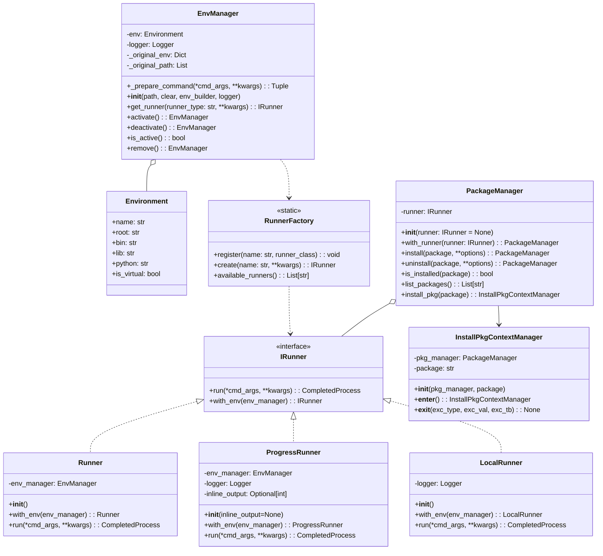
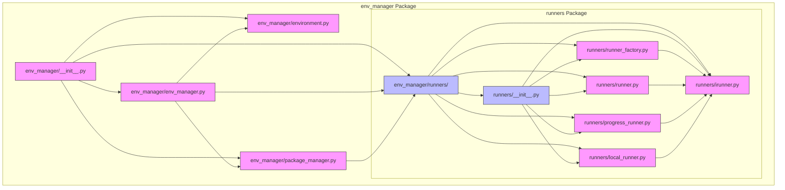

# Environment Manager Architecture Implementation

## Overview

This document outlines the completed redesign of the Python Environment Manager architecture, focused on improving separation of concerns, maintainability, and extensibility by applying SOLID principles. The main achievements were:

1. ✅ Extracted command preparation logic into a dedicated method
2. ✅ Created a separate Runner hierarchy for command execution
3. ✅ Made a completely independent PackageManager
4. ✅ Removed EnvManagerWithProgress class in favor of the ProgressRunner

## Architecture Diagram



## Components Diagram

The file structure and component organization after the implementation:



### File Responsibilities

| File | Primary Responsibility |
|------|------------------------|
| `environment.py` | Defines the Environment class for representing Python environments |
| `env_manager.py` | Defines the EnvManager class for managing environment lifecycle |
| `package_manager.py` | Defines PackageManager and InstallPkgContextManager for package operations |
| `runners/__init__.py` | Initializes the runners package and registers default runners |
| `runners/irunner.py` | Defines the IRunner interface for command execution |
| `runners/runner_factory.py` | Implements the RunnerFactory for creating runner instances |
| `runners/runner.py` | Implements the standard Runner for virtual environments |
| `runners/progress_runner.py` | Implements the ProgressRunner for progress visualization |
| `runners/local_runner.py` | Implements the LocalRunner for local Python execution |

## Component Descriptions

### Environment Class
- Represents a Python environment with all relevant paths and properties
- No significant changes were made to this class

### IRunner Interface
- Abstract base class defining the command execution interface
- Methods:
  - `run(*cmd_args, **kwargs)`: Execute commands
  - `with_env(env_manager)`: Configure the runner with an environment manager

### EnvManager Class
- Focuses exclusively on environment lifecycle management (activation, deactivation)
- Added methods:
  - `_prepare_command(*cmd_args, **kwargs)`: Extracts command preparation logic from run method
  - `get_runner(runner_type, **kwargs)`: Factory method to obtain various runner types
- Removed methods:
  - `run()`: Now handled by runners
  - `run_local()`: Now handled by LocalRunner

### RunnerFactory Class
- Static factory for creating different types of runners
- Methods:
  - `register(name, runner_class)`: Register a new runner type
  - `create(name, **kwargs)`: Create a runner of the specified type
  - `available_runners()`: List available runner types

### Runner Implementations
- **Runner**: Standard command execution within the virtual environment
- **ProgressRunner**: Command execution with progress bar visualization
- **LocalRunner**: Command execution using the local Python installation

### PackageManager
- Completely independent component for package management
- Methods:
  - `install(package, **options)`: Install a package
  - `uninstall(package, **options)`: Uninstall a package
  - `is_installed(package)`: Check if a package is installed
  - `list_packages()`: List installed packages
  - `install_pkg(package)`: Context manager for temporary package installation

## Implementation Details

### Step 1: Created the `_prepare_command` Method in EnvManager
- Extracted command preparation logic into a new method
- Returns the prepared command and modified kwargs

### Step 2: Defined the IRunner Interface
- Created an abstract base class that defines the command execution interface
- Included methods for environment configuration and command execution

### Step 3: Implemented Runner Classes
- Created the standard Runner implementation
- Created ProgressRunner with progress visualization features
- Created LocalRunner for local Python execution

### Step 4: Created the RunnerFactory
- Implemented static factory for creating and registering runners
- Set up default runner registrations

### Step 5: Created the PackageManager
- Implemented package management functionality
- Created InstallPkgContextManager for temporary installations

### Step 6: Updated EnvManager
- Removed run and run_local methods
- Added get_runner method for obtaining runners
- Updated to use fluent pattern (methods returning self)

### Step 7: Removed EnvManagerWithProgress
- Removed this class as its functionality is now in ProgressRunner

## SOLID Principles Implementation

### Single Responsibility Principle (SRP)
- **Environment**: Represents environment information and paths
- **EnvManager**: Focuses exclusively on environment lifecycle
- **IRunner**: Pure command execution abstraction
- **Runner Implementations**: Each with specific execution patterns
- **PackageManager**: Dedicated to package operations only

### Open/Closed Principle (OCP)
- The system is extensible through interfaces:
  - New runner types can be added by implementing IRunner
  - PackageManager can be extended with new operations
  - RunnerFactory allows registering new runner types

### Liskov Substitution Principle (LSP)
- All runner implementations can be used interchangeably
- Clients depend on interface behaviors, not implementations

### Interface Segregation Principle (ISP)
- **IRunner**: Focused solely on command execution
- **PackageManager**: Separate interface for package operations
- Clear separation between command execution and package management

### Dependency Inversion Principle (DIP)
- High-level components depend on abstractions (IRunner)
- Dependencies are injected rather than created internally
- Factory pattern provides abstraction for runner creation

## Usage Examples

```python
# Create environment manager
env_manager = EnvManager("path/to/venv")

# Method 1: Using EnvManager's get_runner method (recommended)
standard_runner = env_manager.get_runner("standard")
standard_runner.run("pip", "list")

# Method 2: Using RunnerFactory directly
# Create a runner and configure it with the environment manager
standard_runner = RunnerFactory.create("standard").with_env(env_manager)
standard_runner.run("pip", "list")

# Using a progress runner for long-running operations
progress_runner = env_manager.get_runner("progress")
progress_runner.run("pip", "install", "large-package")

# Using a local runner for system Python operations
local_runner = env_manager.get_runner("local")
local_runner.run("python", "--version")

# Use package manager for advanced operations
from env_manager import PackageManager
pkg_manager = PackageManager(standard_runner)
pkg_manager.install("requests")

# Temporary package installation
with pkg_manager.install_pkg("pytest"):
    standard_runner.run("pytest", "--version")
```

## Benefits of the New Architecture

1. **Improved Separation of Concerns**: Each component has a clear, single responsibility
2. **Enhanced Extensibility**: New functionality can be added without modifying existing code
3. **Better Testability**: Components can be tested in isolation
4. **More Flexible Composition**: Components can be combined in various ways
5. **Clearer API**: The fluent interface provides a more intuitive API

## Test Implementation

All test cases were updated to use the new architecture:

1. **Unit Tests**:
   - Updated to test individual components (Runner, PackageManager, etc.)
   - New tests added for RunnerFactory and different runner implementations

2. **Integration Tests**:
   - All updated to use the runner pattern instead of direct EnvManager.run
   - Package installation tests use PackageManager

This architecture redesign provides a solid foundation for future enhancements while improving the maintainability and flexibility of the system.